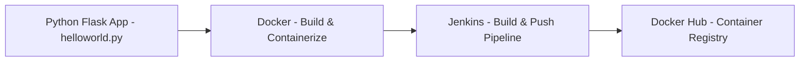

# Python Hello World — Docker + Jenkins (Flask Web App)


[](https://hub.docker.com/r/shivanijoshi38/pythonhelloworld)
[](LICENSE)
[](https://github.com/assign-stone/python-hello-world-docker-jenkins)

A practical, hands-on example that demonstrates how to create a **Python Flask web app**, containerize it with Docker, and automate builds and publishing using Jenkins. This project is designed as a **foundation for CI/CD experimentation**, easily adaptable to your own projects.

---

## Why this repository exists

- Teach the basics of containerizing a Python app.
- Show a minimal Dockerfile and how to build/run images locally.
- Provide a sample Jenkins pipeline to automate image builds and pushes to Docker Hub.
- Serve as a starting point for CI/CD experiments.

---

## What you’ll find here

* `helloworld.py` — a simple Flask web app that responds in the browser
* `Dockerfile` — packages the Flask app into a minimal image
* `Jenkinsfile` — an optional Declarative Pipeline that builds and pushes the image

---

## Workflow Overview

Visual representation of the pipeline:



---

## Project structure

```
.
├── Dockerfile
├── Jenkinsfile     # example pipeline (optional)
└── helloworld.py
```

---

## Getting started — local workflow

Replace `assign-stone` with your Docker Hub username if publishing under a different account.

### 1. Clone the repository

```bash
git clone https://github.com/assign-stone/python-hello-world-docker-jenkins.git
cd python-hello-world-docker-jenkins
```

### 2. Inspect or create the Flask app

```python
# helloworld.py
from flask import Flask

app = Flask(__name__)

@app.route('/')
def hello():
    return "Hello, World from Dockerized Flask App!"

if __name__ == "__main__":
    app.run(host="0.0.0.0", port=5000)
```

---

### 3. Create or review the Dockerfile

```dockerfile
FROM python:3.12-slim

WORKDIR /app

# Install Flask
RUN pip install --no-cache-dir flask

COPY helloworld.py .

# Expose Flask port
EXPOSE 5000

CMD ["python", "helloworld.py"]
```

---

### 4. Run the container locally (EC2)

```bash
docker build -t assign-stone/pythonhelloworld:latest .
docker run -p 5000:5000 assign-stone/pythonhelloworld:latest
```

---

### 5. Access the app in a browser via EC2 public IP

1. Go to **EC2 Console → Your Instance → Security Groups → Inbound Rules**
2. Add a rule to allow traffic on **port 5000** from `0.0.0.0/0` (or your IP).
3. Open a browser and go to:

```
http://<EC2_PUBLIC_IP>:5000
```

You should see:

```
Hello, World from Dockerized Flask App!
```

---

## Publishing to Docker Hub

1. Log in:

```bash
docker login
```

2. Tag and push the image:

```bash
docker tag assign-stone/pythonhelloworld:latest assign-stone/pythonhelloworld:latest
docker push assign-stone/pythonhelloworld:latest
```

3. Pull and run from another host:

```bash
docker pull assign-stone/pythonhelloworld:latest
docker run -p 5000:5000 assign-stone/pythonhelloworld:latest
```

Then access in the browser:

```
http://<host-ip>:5000
```

---

## Jenkins CI — example pipeline

The Jenkinsfile demonstrates:

* Checking out the repo
* Building a Docker image and tagging it
* Pushing the image to Docker Hub using Jenkins credentials

**Jenkinsfile example:**

```groovy
pipeline {
    agent any

    environment {
        DOCKERHUB_CREDENTIALS = credentials('dockerhub')
        IMAGE_NAME = "shivanijoshi38/pythonhelloworld"
    }

    stages {
        stage('Checkout Code') {
            steps {
                git branch: 'main', url: 'https://github.com/assign-stone/python-hello-world-docker-jenkins.git'
            }
        }

        stage('Build Docker Image') {
            steps {
                script {
                    sh "docker build -t ${IMAGE_NAME}:latest ."
                }
            }
        }

        stage('Push to Docker Hub') {
            steps {
                script {
                    withDockerRegistry([credentialsId: 'dockerhub', url: '']) {
                        sh "docker push ${IMAGE_NAME}:latest"
                    }
                }
            }
        }
    }
}
```

---

### Jenkins setup notes

* Create a Jenkins credential (`dockerhub`) containing your Docker Hub username and password.
* Ensure the Jenkins agent has Docker installed and can run Docker commands.
* For multi-branch pipelines, enable branch scanning to automatically build any branch containing a Jenkinsfile.

---

### Troubleshooting tips

* **Docker build fails** → Ensure Jenkins user has access to the Docker daemon.
* **Docker push fails** → Verify credentials and that the Jenkins credential ID matches.
* **Cannot access Flask app via EC2** → Check security group inbound rules and use `host="0.0.0.0"` in Flask app.

---

## Contributing

We love contributions! 🚀

Whether it’s improving the CI/CD workflow, adding tests, enhancing documentation, implementing secure Docker practices, or sharing new ideas, your help makes this project better for everyone. Open an issue, submit a pull request, or suggest improvements — **all contributions are welcome!**

---

## License

MIT License — feel free to reuse and adapt.

---

## Author

* assign-stone
